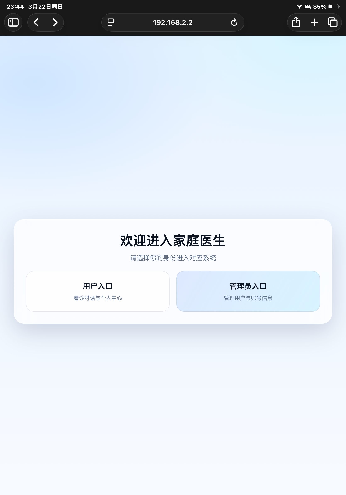

# DSSpringAIFamilyDoctor

家庭医生对话项目（前后端分离）：
- 后端：`deepseek-doctor`（Spring Boot + MyBatis-Plus + DashScope Native SDK + SSE）
- 前端：`family-doctor`（静态页面 + Vue2 + Axios）

## 目录结构

```text
deepseek-springai-family-doctor/
├── deepseek-doctor/      # Java 后端
└── family-doctor/        # 前端静态资源（5500 端口访问）
```

## 应用演示

将演示文件放到仓库根目录的 `docs/` 下：
- `docs/demo-cover.png`（封面图）
- `docs/demo.mp4`（演示视频，建议 < 100MB）

README 展示方式（GitHub 稳定）：

[](docs/demo.mp4)

可选内嵌播放器（部分平台渲染可能不稳定）：

```html
<video src="docs/demo.mp4" controls width="900"></video>
```

## 核心能力

- JWT 登录/注册与鉴权
- 聊天非流式接口：`POST /ollama/chat`
- 聊天流式接口：`POST /ollama/chat/stream`
- SSE 推送：`GET /sse/connect`
- 聊天记录查询/清空：`GET/DELETE /ollama/records`
- 会话指标落库：`firstTokenMs`、`totalMs`、`avgTokenIntervalMs`、`outputTokens` 等

## 环境要求

- JDK 21
- Maven 3.9+
- MySQL 8.x

## 后端配置

主配置文件：
- `deepseek-doctor/src/main/resources/application.yml`
- `deepseek-doctor/src/main/resources/application-dev.yml`

关键环境变量（DashScope）：

```bash
export DASHSCOPE_API_KEY=你的Key
export DASHSCOPE_MODEL=qwen3-235b-a22b
export DASHSCOPE_BASE_URL=https://dashscope.aliyuncs.com/api/v1
```

压测/联调可开启 Mock 模式：

```bash
export DASHSCOPE_MOCK_ENABLED=true
export DASHSCOPE_MOCK_RESPONSE="这是本地压测Mock回复。"
export DASHSCOPE_MOCK_FIRST_TOKEN_DELAY_MS=120
export DASHSCOPE_MOCK_CHUNK_DELAY_MS=60
export DASHSCOPE_MOCK_CHUNK_SIZE=8
```

## 数据库准备

1. 创建数据库：`deepseek_doctor`
2. 执行表结构（可参考 `deepseek-doctor/PRODUCT.md` 中 SQL）
3. 新增指标字段迁移：

```sql
ALTER TABLE chat_metric
ADD COLUMN avg_token_interval_ms DECIMAL(10,2) NULL COMMENT '相邻输出token（或chunk）平均到达间隔（毫秒）'
AFTER total_ms;
```

对应脚本文件：
- `deepseek-doctor/src/main/resources/sql/20260322_add_avg_token_interval_ms.sql`

## 启动方式

## 1) 启动后端

```bash
cd deepseek-doctor
mvn spring-boot:run
```

或使用脚本：

```bash
cd deepseek-doctor
./run.sh
```

默认端口 `8080`，已监听 `0.0.0.0`（局域网可访问）。

## 2) 启动前端

`family-doctor` 是静态页面，建议用 VSCode Live Server 或任意静态服务器启动到 `5500` 端口。

示例访问：
- `http://<你的局域网IP>:5500/pages/entry.html`

前端会自动按当前 host 拼接后端地址：`http://<host>:8080`。

## 测试与调试

后端目录内已提供实操脚本：

```bash
cd deepseek-doctor
chmod +x tools/start_mock.sh tools/llm_smoke.sh tools/start_with_proxy.sh
```

- 一键 Mock 启动：`./tools/start_mock.sh`
- 端到端冒烟（登录 + 同步 + SSE 流式）：`./tools/llm_smoke.sh`
- 代理抓包启动（后端 -> 模型平台）：`PROXY_HOST=127.0.0.1 PROXY_PORT=8888 ./tools/start_with_proxy.sh`
- JMeter 用例：`tools/jmeter/llm_chat_test.jmx`

详细步骤见：
- `deepseek-doctor/LLM_TESTING_GUIDE.md`

## 常见问题

## 1) `401 Unauthorized`（模型调用）

优先检查：
- `DASHSCOPE_API_KEY` 是否正确
- `DASHSCOPE_MODEL` 是否有权限（例如 `qwen3-235b-a22b`）
- `DASHSCOPE_BASE_URL` 是否与当前网关一致

## 2) SSE 没有流式返回

优先检查：
- 是否先建立 `GET /sse/connect?userId=xxx&token=xxx`
- token 是否有效、`userId` 是否与登录用户一致
- 前端 Network 中 SSE 连接是否保持 pending
